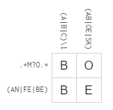
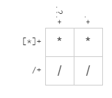

# Lab 01 Report - Introduction to Open Source Software
## Part 1
### Name: Trevor Crystal
### Email: crystt@rpi.edu
### Photo of me: 
### Discord: penguino9879
### Discord screenshot: 
## Part 2
### How to Answer Questions in a Helpful Way
1) Do not act condescending.
2) If the question was asked publicly, you don't know the answer, and nobody else has answered, then mention that you are also unsure to get more traction to the question.
### Free Culture
The main thing I got out of reading this is that the RIAA is extremely predatory, although from the Youtube-dl incident on Github I had already known that. From both, it is clear that if your code even so much as touches music, the RIAA will come for you. Even if it is just a search engine that finds what other people upload, then the RIAA will come for you. Lawsuits are usually significantly more expensive than settlements, even if you are almost certainly guaranteed to win. What the book didn't say is the outcome of the similar situations at Michigan Technical University and Princeton. I expect that they would have had a similar result though. I did a little extra research and found this was the case.
## Part 3
### Tree Screenshot: 
## Part 4
### Regex part 1: First 7 solutions
```
^-?\d{1,3}(,\d{3})?(\.\d+(\e\d+)?)?$
(\d{3})
([^+@]*)
<([^\s>]+)
^([^.]*)\.(jpg|png|gif)$
\s*(.*)
at\swidget\.List\.([^\(]+)\(([^:]+):(\d+)
```
### Regex part 2:    
## Part 5
### Blockly Solution: 
## Part 6
There are some larger open source projects that I find interesting that I have used before. One of them is MuseScore, a piece of software for creating sheet music. I also like emulators, with Dolphin being the one I have used the most. Those projects both look like they have a large learning curve for contributing, so I'm not sure how practical it would be to start contributing to them this semester. I am also in RCOS, and am using that to find other open source projects I can work on. I worked on Open Circuits last semester, and will continue doing so this semester. I saw someone somewhere ask Professor Turner if we can work on the same project in both classes if we are doing distinct things on it, and he said yes. I'm considering doing that with Open Circuits, in one of the courses I could focus on improvements to the analog side and in the other, I can work on improvements to the digital.