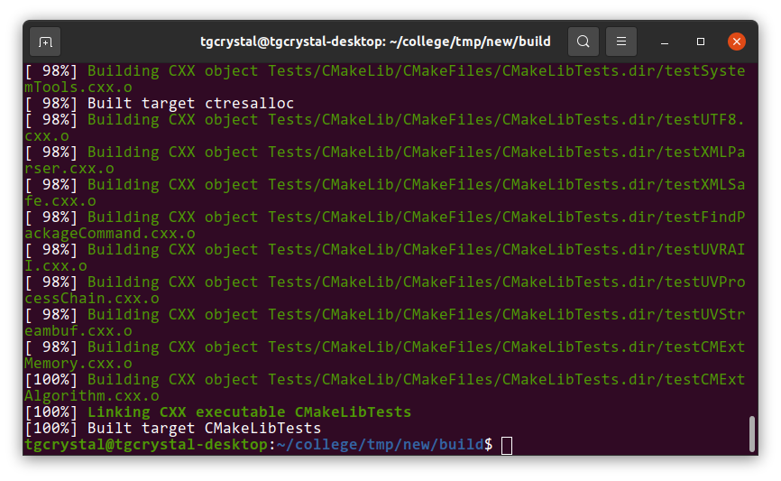
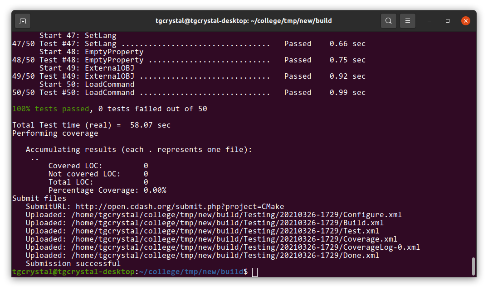
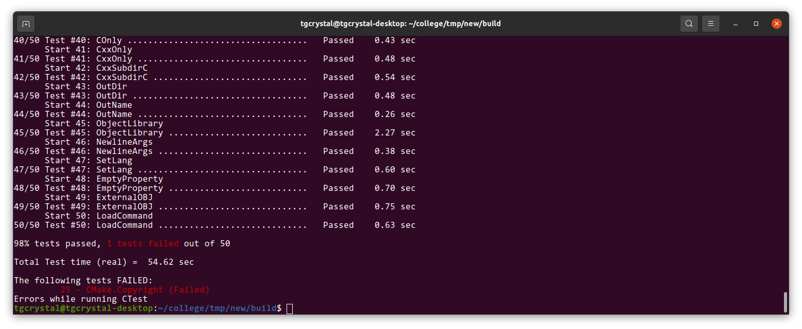
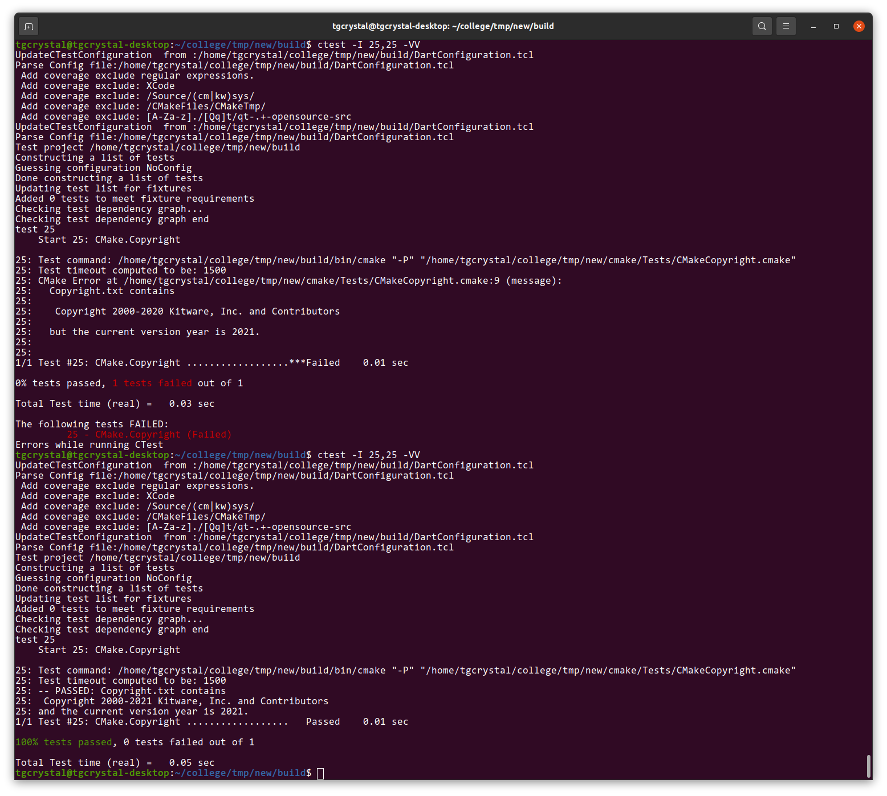
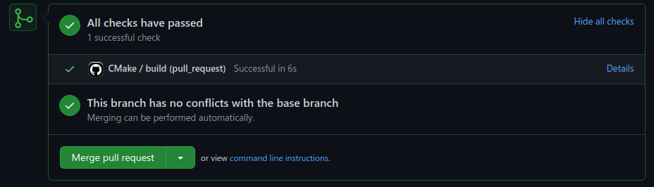
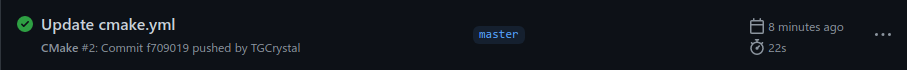

## Checkpoint 1

## Checkpoint 2

The tests run for each submission can be found by clicking the build name, scroll down to "View Tests Summary", and click on that.

 failed. It does show the line of the test file that failed, along with why it failed. It also showed the command that failed. As far as I can tell though, it does say `ctresalloc.log` does not match but I do not see what it is does print or is supposed to print. 

I am on Ubuntu so  would be kind of close to my configuration. It looks like the only test that failed did so due to connecting to some website, so I don't think this would be an issue for me. 

Command line after running the tests:

## Checkpoint 3

Result from `ctest -I 1,50`

I ran `ctest -I 25,25 -VV` to see the verbose output for the failing test, and it showed the test failed because the copyright went until 2020 but the current year is 2021. Here is a screenshot of before and after fixing that:

## Checkpoint 4

Screenshots:

