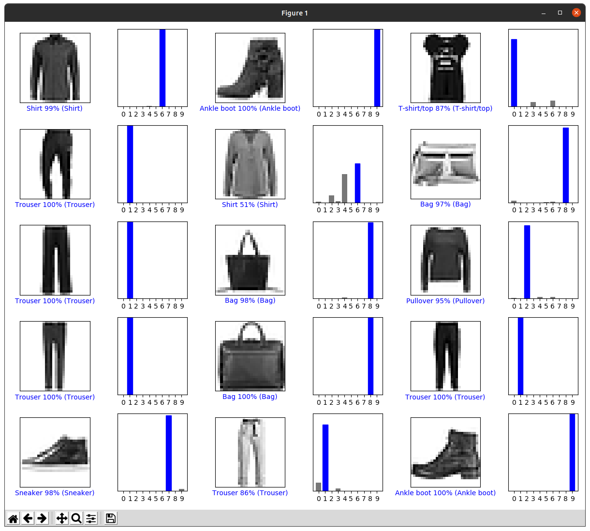

## Checkpoint 1


## Checkpoint 2

Modified code:
```
num_rows = 5
num_cols = 3
num_images = num_rows*num_cols
plt.figure(figsize=(2*2*num_cols, 2*num_rows))
for i in range(num_images):
  plt.subplot(num_rows, 2*num_cols, 2*i+1)
  plot_image(i+9000, predictions[i+9000], test_labels, test_images)
  plt.subplot(num_rows, 2*num_cols, 2*i+2)
  plot_value_array(i+9000, predictions[i+9000], test_labels)
plt.tight_layout()
plt.show()
```

Screenshot:


## Checkpoint 3

Original 1:

Converted 1:


Converted 2:


Converted 3:

