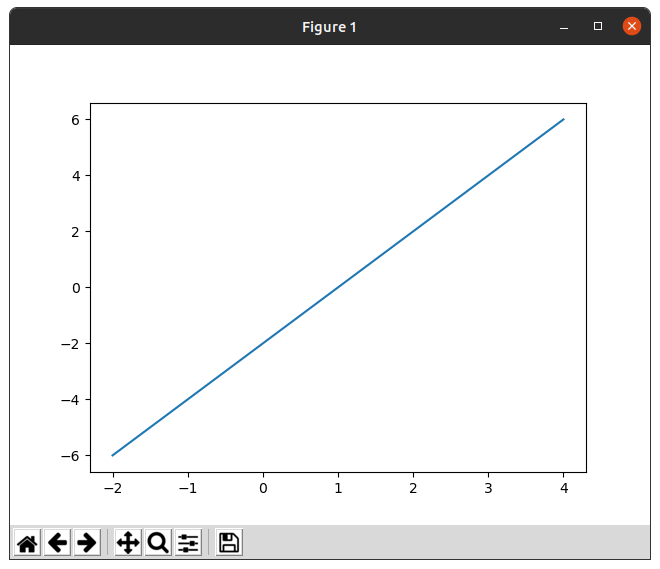

## Checkpoint 1



## Checkpoint 2

Modified code:
```
num_rows = 5
num_cols = 3
num_images = num_rows*num_cols
plt.figure(figsize=(2*2*num_cols, 2*num_rows))
for i in range(num_images):
  plt.subplot(num_rows, 2*num_cols, 2*i+1)
  plot_image(i+9000, predictions[i+9000], test_labels, test_images)
  plt.subplot(num_rows, 2*num_cols, 2*i+2)
  plot_value_array(i+9000, predictions[i+9000], test_labels)
plt.tight_layout()
plt.show()
```

Screenshot:


## Checkpoint 3

Original 1:

Converted 1:


Converted 2:


Converted 3:


Results:
```
[8.1886184e-01 2.2001367e-03 2.2733854e-02 1.6532317e-02 1.4674147e-03
 2.2012132e-04 1.3721137e-01 4.3497460e-07 6.9461740e-04 7.7907083e-05]
0
T-shirt/top

[1.8623037e-02 1.3481029e-08 7.8170741e-01 1.9725940e-05 1.5569544e-01
 1.6407732e-10 4.3695562e-02 4.1275434e-12 2.5875791e-04 4.9840371e-10]
2
Pullover

[9.9001091e-04 9.9817932e-01 8.3937361e-05 6.5728743e-04 6.6052038e-05
 3.9046014e-10 2.3252127e-05 2.2022928e-14 1.2553251e-07 2.1471326e-10]
1
Trouser
```

Looks like the only one it got wrong was the coat. It probably got confused by the drawstring, since that is uncommon on coats but common on pullovers.